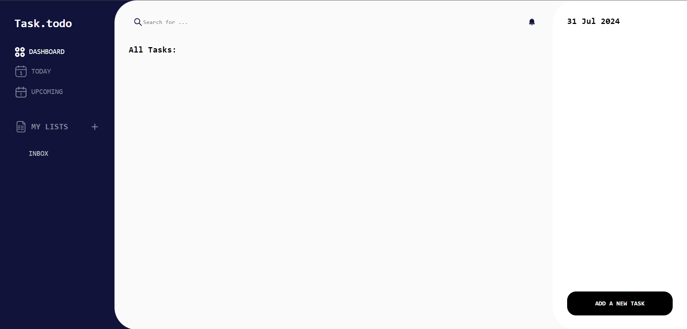

# task.todo

This is a todo list app.

## Table of contents

- [Overview](#overview)
  - [The challenge](#the-challenge)
  - [Screenshot](#screenshot)
  - [Links](#links)
- [My process](#my-process)
  - [Built with](#built-with)
  - [Useful resources](#useful-resources)
- [Author](#author)

## Overview

### The challenge

Users should be able to:

- create a new list
- add a new task, delete it and toggle task status

### Screenshot

### Links

- Solution URL: [Add solution URL here](https://github.com/bashair0/task.todo)
- Live Site URL: [Add live site URL here](https://bashair0.github.io/task.todo/)

## My process

### Built with

- Semantic HTML5 markup
- CSS custom properties
- Flexbox
- CSS Grid

### Useful resources

- [date-fns](https://github.com/date-fns/date-fns) - This resource which contains a bunch of handy functions for formatting and manipulating dates and times helped me so much in formatting due dates. I really like it and I will use it in future projects.

## Author

- github - [bashair0](https://github.com/bashair0)
- Frontend Mentor - [@bashair0](https://www.frontendmentor.io/profile/bashair0)
